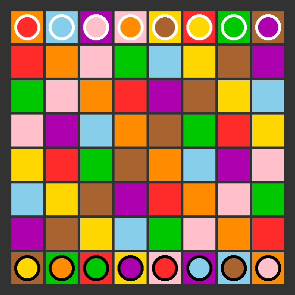

# Kamisado Game



## The state

```json
{
  "board": [
    [
      ["orange", ["pink", "light"]],
      ["blue", ["orange", "light"]],
      ["purple", ["green", "light"]],
      ["pink", ["red", "light"]],
      ["yellow", ["purple", "light"]],
      ["red", ["blue", "light"]],
      ["green", ["brown", "light"]],
      ["brown", ["yellow", "light"]]
    ],
    [
      ["red", null],
      ["orange", null],
      ["pink", null],
      ["green", null],
      ["blue", null],
      ["yellow", null],
      ["brown", null],
      ["purple", null]
    ],
    [
      ["green", null],
      ["pink", null],
      ["orange", null],
      ["red", null],
      ["purple", null],
      ["brown", null],
      ["yellow", null],
      ["blue", null]
    ],
    [
      ["pink", null],
      ["purple", null],
      ["blue", null],
      ["orange", null],
      ["brown", null],
      ["green", null],
      ["red", null],
      ["yellow", null]
    ],
    [
      ["yellow", null],
      ["red", null],
      ["green", null],
      ["brown", null],
      ["orange", null],
      ["blue", null],
      ["purple", null],
      ["pink", null]
    ],
    [
      ["blue", null],
      ["yellow", null],
      ["brown", null],
      ["purple", null],
      ["red", null],
      ["orange", null],
      ["pink", null],
      ["green", null]
    ],
    [
      ["purple", null],
      ["brown", null],
      ["yellow", null],
      ["blue", null],
      ["green", null],
      ["pink", null],
      ["orange", null],
      ["red", null]
    ],
    [
      ["brown", ["yellow", "dark"]],
      ["green", ["green", "dark"]],
      ["red", ["orange", "dark"]],
      ["yellow", ["purple", "dark"]],
      ["pink", ["red", "dark"]],
      ["purple", ["brown", "dark"]],
      ["blue", ["blue", "dark"]],
      ["orange", ["pink", "dark"]]
    ]
  ],
  "color": null,
  "current": 0,
  "players": ["LUR", "FKY"]
}
```

The first player in the list of player is the starting player. It use the dark
tiles.

`current` is the indice of the current player in the `players` list.

The `board` is a list of `row`. A `row` is a list of `cell`. A `cell` is a list
that contains a `color` and a `tile`. A `tile` is a list that contains a `color`
and a `kind`. The `tile` can be `null` if there is no tile on that cell. A
`color` is one of the **color strings**. A `kind` is either `"dark"` or
`"light"`.

The **color strings** are:

```json
["orange", "blue", "purple", "pink", "yellow", "red", "green", "brown"]
```

The `color` key of the state indicates the color of the tile to be played. Its
value is `null` for the first move.

## A Move

```json
[
  [7, 4],
  [1, 4]
]
```

A `move` is list of 2 `positions`. A `position` is a list of 2 integer between 0
and 7 inclusive. The first `position` indicates the tile the player wants to
move. The second `position` indicates the destination of the tile.

The first component of a `position` is the row number. The second component is
the column number. the rows of the board are numbered from top to bottom
beginning with 0. The colums are numbered from left to right beginning with 0.
