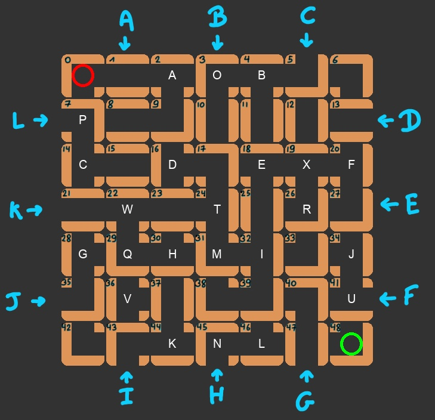

# Labyrinthe Game



## The State

```json
{
  "players": ["LUR", "HSL"],
  "current": 0,
  "positions": [6, 47],
  "target": 3,
  "remaining": [4, 4],
  "tile": <the free tile>,
  "board": <list of 49 tiles>
}
```

The first player that appears in the `players` list is the player that begin at the top left corner. The second player begin at the bottom right corner.

`current` is the indice of the current player in the `players` list.

The `positions` key contains the positions of the two players.

The `target` key contain the id of the treasure you must reach.

The `remaining` key contains the numbers of treasures each player still has to reach.

The `board` is a list of tiles. It contains every row of the board from top to bottom (see indexes on the figure at the top).

The `tile` key contains the free tile.

Each tile is a JSON object: 

```json
{
  "N": true,
  "E": false,
  "S": true,
  "W": true,
  "item": 1
}
```

The `N` (North), `E` (East), `S` (South) and `W` (West) keys tells if the tile is open in that direction. The `item` key contains the treasure id of the tile.

## A Move

```json
  {
    "tile": <the tile in the good orientation>,
    "gate": "A",
    "new_position": 45
  }
```

The `tile` key contains the free tile to push on the board in the orientation you want it to be pushed.

The `gate` key contains the gate through which you want the free tile to be pushed on the board (see the figure at the top).

The `new_position` contains the index of the tile you want your piece to go after the tile was pushed.

If the same state (same player turn + same board configuration) occurs more than 2 times, the game is over with a draw.
