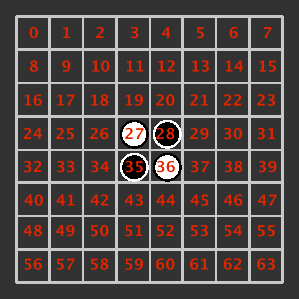

# Othello Game



## The State

```json
{
   "players": ["LUR", "LRG"],
   "current": 0,
   "board": [
      [28, 35],
      [27, 36]
   ]
}
```

The first player that appears in the `players` list is the player that begin the game with the black pieces.

`current` is the indice of the current player in the `players` list.

The `board` is two lists. The first lists the positions where black have a piece. the second lists positions of white.

## A Move

```json
26
```

A move is just the position where the current player want to play.

You can pass your turn by sending `null`.