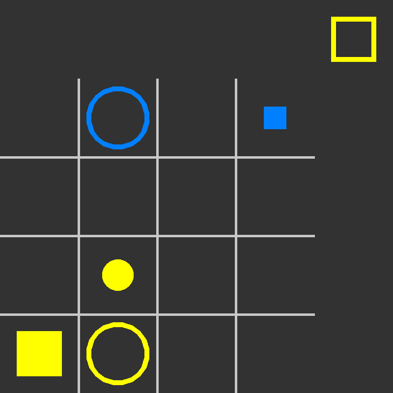

# Quoridor Game



## The State

```json
{
  "players": ["LUR", "FKY"],
  "current": 0,
  "board": [
    null,
    "BDEC",
    null,
    "SDFP",
    null,
    null,
    null,
    null,
    null,
    "SLFC",
    null,
    null,
    "BLFP",
    "BLEC",
    null,
    null
  ], // a list of 16 strings or null
  "piece": "BLEP"
}
```

The first player that appears in the `players` list is the player that choose
the first piece for the second player.

`current` is the indice of the current player in the `players` list.

The `board` is a a list of 16 strings containing 4 characters. Each character
stands for one feature of the piece:

- `B` (Big) or `S` (Small)
- `D` (Dark) or `L` (Light)
- `E` (Empty) or `F` (Full)
- `C` (Cylinder) or `P` (Prism)

The order of the characters doesn't matters

The `piece` is the that the current player must play. It will be `null` for the
first move.

## A Move

```json
{
  "pos": 8, // Position on the board
  "piece": "BLEC" // Choosen piece for the next player
}
```

The `pos` is the position where we want to play the piece given in the state. It
can be `null` or omited for the first move.

The `piece` is the piece that we choose for our opponent to play. It can be
`null` or omited for the last move.
